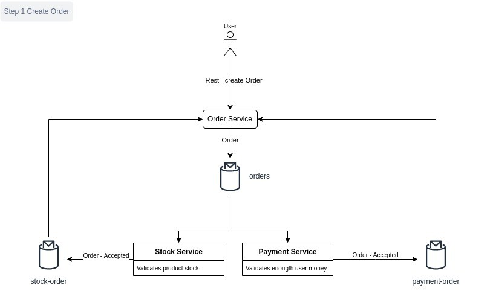
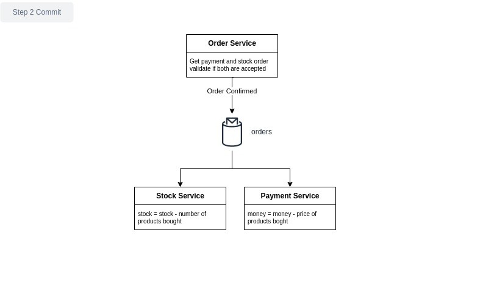

# spring-kafka-sagas
Project showing an order creation system with microservice architecture, the transaction is split into three microservices using the Sagas pattern  

## Dependencies
- [x] SpringBoot
- [x] Kafka Streams
- [x] Kubernetes - Minikube
- [x] Lombok
- [x] Jib - Google tool to create docker images

## Start the application

Execute the start.sh command, in the middle of the process, it will ask you the sudo credentials

```console
sh start.sh
```

## Stop the application

Execute the stop.sh command

```console
sh stop.sh
```

## Validate the deployment

Here in postman folder, you will find two end points

* POST - http://192.168.49.2:30001/orders to create orders
* GET http://192.168.49.2:30001/orders to get all the created orders

## Diagram
The process involved in this example is explained using next diagram



The process starts when user send a POST rest request to create an order to the order system, next steps are involved

1. Order service receives the order request and publish a message to the Orders Kafka topic
2. Payment service consume the message published to order service and validate if the user has the amount of money for the total of the order and publish a message to the payment orders topic
   1. If the user has money, the order status is ACCEPTED
   2. If the user does not have enough money, order status is set to REJECTED
3. Stock service consume the message published to order service and validate if the product has stock and publish a message to the stock orders topic
   1. If the product has stock, the order status is ACCEPTED
   2. If the product does not have stock, order status is set to REJECTED
   



The step two defines if the complete transaction will be committed or rollback

1. The order service consume a Stream of the payment orders topic joined to the stock-orders topic, depending on the status for payment and stock orders, order service publish a order with status CONFIRMED, REJECTED or ROLLBACK
   1. If both order status are ACCEPTED, status will be CONFIRMED, payment and stock service COMMIT its local transactions
   2. If both are REJECTED, status will be REJECTED and neither payment nor stock services do nothing
   3. If one is ACCEPTED and the other REJECTED, the status will be ROLLBACK, and the service with ACCEPTED status, should ROLLBACK its local transaction

## Documentation

This example is based on **Distributed Transactions in Microservices with Kafka Streams and Spring Boot** tutorial

* [Tutorial theory](https://piotrminkowski.com/2022/01/24/distributed-transactions-in-microservices-with-kafka-streams-and-spring-boot/)
* [Tutorial GitHub](https://github.com/piomin/sample-spring-kafka-microservices)
* [Kafka Streams Theory](https://medium.com/sfu-cspmp/sailing-through-kafka-streams-ec045d78c667)
* [Build and Publish Docker images JIB](https://docs.google.com/document/d/1_O5EEtaPmaq-O7HwxAjPX2std6iEpvdjXaaHKuYDK20/edit#heading=h.qmqg80fj22di)

